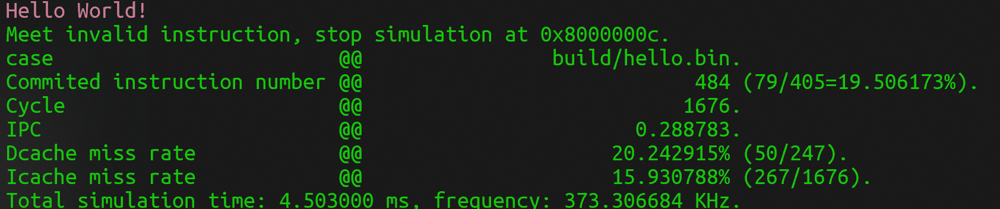

# OIRV
鸥逸（OI）RISC-V ~！OIRV 为开源的 RISC-V 顺序处理器核，支持配置为 RV32 或 RV64 架构，支持乘除法拓展（M）、压缩指令集拓展（C）、原子指令集拓展（A），并带有可配置的多发射选项（单/双发）以及组相联缓存。OIRV 可作为学习与研究 RISC-V 架构的入门级项目，该项目采用的开源协议为 GPL v3。

## 项目依赖
1. RISC-V GNU 工具链：riscv64-unknown-elf-gcc；
2. Verilator 开源仿真器：https://github.com/verilator/verilator.git ；
3. VCD 波形查看器（任选）；
   
## 项目说明
1. 快速开始：
```shell
cd test # 在 test 目录中进行仿真
## 编译仿真模型、以 rv64i 架构编译 hello 源程序并运行
make start ARCH=rv64i SRC=hello

## 编译仿真模型、以 rv64i 架构编译 hello 源程序运行，并导出仿真波形文件
make wave ARCH=rv64i SRC=hello
```


2. 编译选项：
- start：编译 RTL 仿真模型，同时编译指定的程序；
- dump：编译 RTL 仿真模型，该模型在运行结束后导出寄存器在每个周期的值；
- wave：编译 RTL 仿真模型，该模型在运行结束后导出仿真波形；

3. 编译参数：
- ARCH：指定编译源程序时采用的架构，同时它也会用于指定编译 RTL 仿真模型时采用的架构（RV32 / RV64）；
- FLAG：指定编译源程序时的 CFLAGS；
- SRC：指定源程序的名称（不需要添加后缀，如 SRC=addi、SRC=fdiv 等）；
- T：指定仿真模型运行的最大周期数，默认值为 0（模型将一直保持运行）；

4. RTL 配置选项（vsrc/core/params.v）：
- VERILATOR_SIM：该宏定义设置时，不启用乘除法器的具体实现（仿真速度会降低 1 个数量级）；
  
5. 项目结构：
- test 目录：包含仿真模型的测试平台文件（test_main.cpp）、AXI4 接口文件（axi4_mem.cpp，参考开源项目：https://github.com/secure-v/AXI4-CPP-BFM.git ）以及程序源文件（c、asm_rv32、asm_rv64 目录）、启动脚本文件（bare.lds）、构建脚本文件（Makefile）；
- vsrc/core 目录：包含处理器核的全部 verilog 文件，其中 CACHE 为缓存相关文件、DIV 为除法器相关文件、MUL 为乘法器相关文件。

## 项目指南
TODO ...
